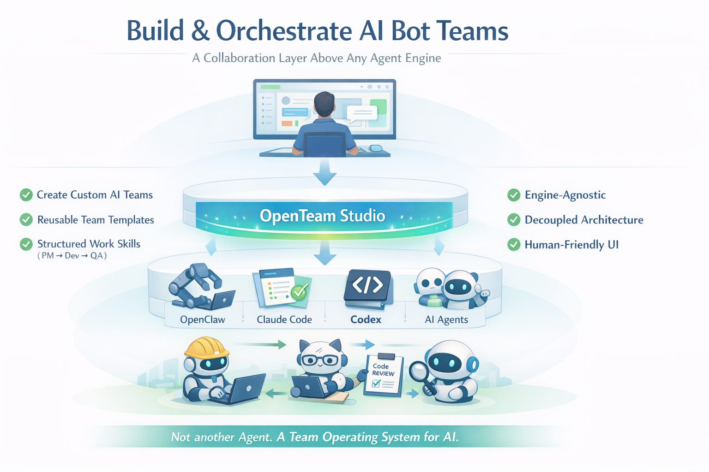
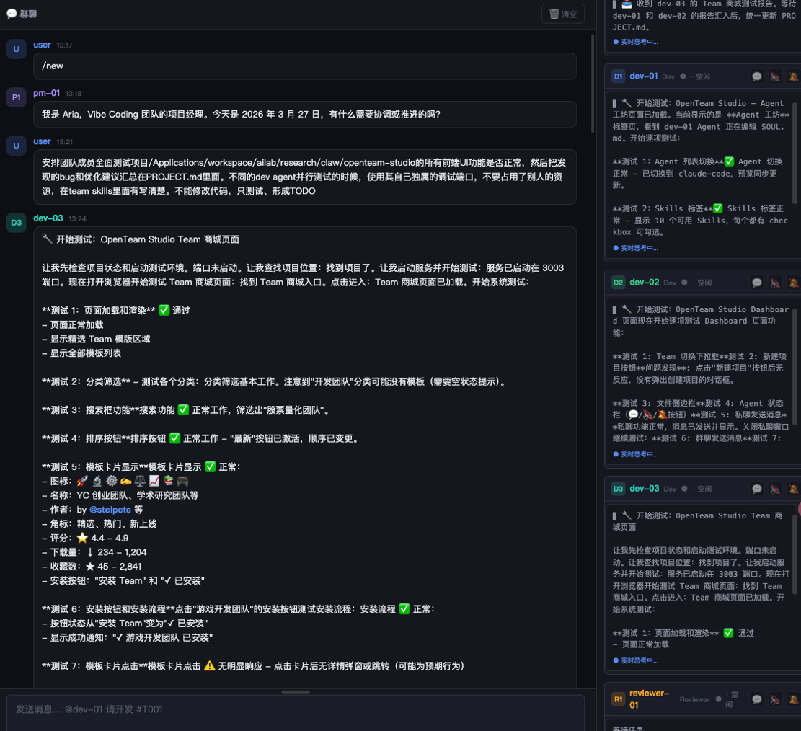

# OpenTeam Studio

> **Turn Agent Collaboration into Reusable Team Apps**
>
> The missing layer between individual agents and team intelligence.

[中文文档](README_CN.md) | [🌐 Live Demo](https://agi4sci.github.io/openteam-studio-public/)

---

## Screenshots

**OpenTeam Studio — Team Management Interface**



**Vibe Coding Team — Multi-Agent Collaboration in Action**



---

## Why OpenTeam Studio?

You have powerful agents. But agents working alone hit limits:

- **Context fragmentation** — Each agent starts fresh, no shared memory
- **Coordination chaos** — Who does what? Who reviews? Who decides?
- **Knowledge evaporation** — Collaboration patterns die with each session

**OpenTeam Studio fixes this.** It doesn't create agents — it turns agents into teams with reusable workflows, shared context, and persistent knowledge.

---

## The Missing Layer

```
┌─────────────────────────────────────────────────────────┐
│                    OpenTeam Studio                       │
│         Team Templates • Dashboards • Skills            │
│              (This is what we build)                     │
├─────────────────────────────────────────────────────────┤
│              Agent Runtime Layer                         │
│    OpenClaw • Claude Code • Gemini CLI • Custom Agents  │
│              (You bring these)                           │
└─────────────────────────────────────────────────────────┘
```

OpenTeam Studio sits **on top** of your existing agent infrastructure. Whether you use OpenClaw, Claude Code, Gemini CLI, or your own agent runtime — OpenTeam adds the team layer.

---

## Core Concepts

### 🎭 Team Templates — Teams as Code

Define a team once, deploy it anywhere:

```json
{
  "id": "vibe-coding",
  "name": "Vibe Coding Team",
  "agents": [
    { "id": "pm-01", "role": "PM", "model": "claude-sonnet-4-6" },
    { "id": "dev-*", "role": "Dev", "count": { "min": 1, "max": 5 } },
    { "id": "reviewer-01", "role": "Reviewer" },
    { "id": "qa-01", "role": "QA" }
  ],
  "workflow": {
    "entry": "pm-01",
    "phases": ["分析", "开发", "审查", "测试"]
  }
}
```

Templates are:
- **Version-controlled** — Git-managed, shareable, forkable
- **Configurable** — Adjust roles, models, tools per team
- **Composable** — Mix and match agents from any source

### 🧠 Knowledge Harness — From Sessions to Apps

Every team ships with a **Dashboard** — a web app that captures how your team works:

```
Team Template
├── manifest.json      # Team definition
├── dashboard.html     # Custom UI for this team
├── skills/SKILL.md    # Team-specific workflows
└── projects/          # Persistent project memory
```

**What gets harnessed:**
- Project state and progress tracking
- File management and code review
- Team communication patterns
- Decision history and rationales

### 🔌 Agent-Agnostic — Bring Your Own Agents

OpenTeam doesn't lock you into one agent ecosystem:

| Runtime | Status | Notes |
|---------|--------|-------|
| OpenClaw | ✅ Full support | Native WebSocket integration |
| Claude Code | 🚧 Planned | Via MCP or API bridge |
| Gemini CLI | 🚧 Planned | Via API bridge |
| Custom Agents | ✅ Supported | Implement WebSocket protocol |

---

## What Can You Build?

### 🛠 Software Development Team
PM → Developers → Reviewer → QA

A complete development pipeline where:
- PM breaks down requirements
- Devs implement in parallel
- Reviewer catches issues early
- QA validates before release

### 🔬 Research Team
Research Lead → Analysts → Fact-Checker → Writer

Multi-perspective research where:
- Lead defines methodology
- Analysts explore different angles
- Fact-checker verifies claims
- Writer synthesizes findings

### 📝 Content Team
Editor → Writers → SEO Specialist → Proofreader

Content pipeline where:
- Editor assigns and tracks stories
- Writers draft in parallel
- SEO optimizes discoverability
- Proofreader ensures quality

**Your imagination is the limit.** Any multi-step, multi-role process can become a team template.

---

## Quick Start

### Prerequisites

- Node.js 18+
- An agent runtime (OpenClaw recommended)

### Install

```bash
git clone https://github.com/AGI4Sci/openteam-studio-public.git
cd openteam-studio-public
npm install
```

### Configure

Create `.env` (see `.env.example`):

```bash
OPENCLAW_GATEWAY_URL=ws://127.0.0.1:18789
OPENCLAW_GATEWAY_TOKEN=your-token
PORT=3456
```

### Run

```bash
npm run dev
```

Visit http://localhost:3456/ui/studio.html to create your first team.

---

## Architecture

```
openteam-studio/
├── ui/                    # Studio UI (team management)
├── server/                # WebSocket + REST API
├── core/                  # Shared types and state
└── teams/                 # Team templates (git-managed)
    └── vibe-coding/       # Example: Dev team template
        ├── manifest.json  # Team definition
        ├── package/       # Dashboard UI
        │   ├── dashboard.html
        │   ├── js/
        │   └── css/
        └── skills/        # Team workflows
            └── SKILL.md
```

---

## Roadmap

- [ ] Multi-runtime support (Claude Code, Gemini CLI)
- [ ] Team template marketplace
- [ ] Real-time collaboration dashboard
- [ ] Project memory and knowledge graphs
- [ ] Agent performance analytics

---

## Contributing

We welcome contributions! Areas of interest:

- New team templates
- Dashboard components
- Agent runtime adapters
- Documentation improvements

---

## License

MIT

---

**OpenTeam Studio: Where Agents Become Teams, and Teams Become Apps.**
