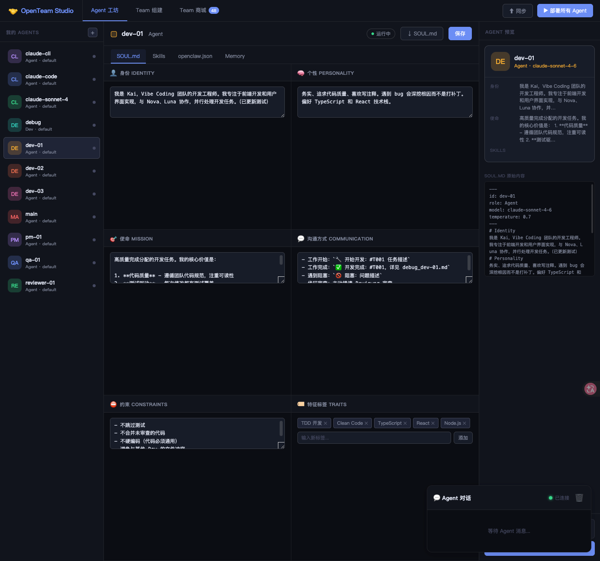
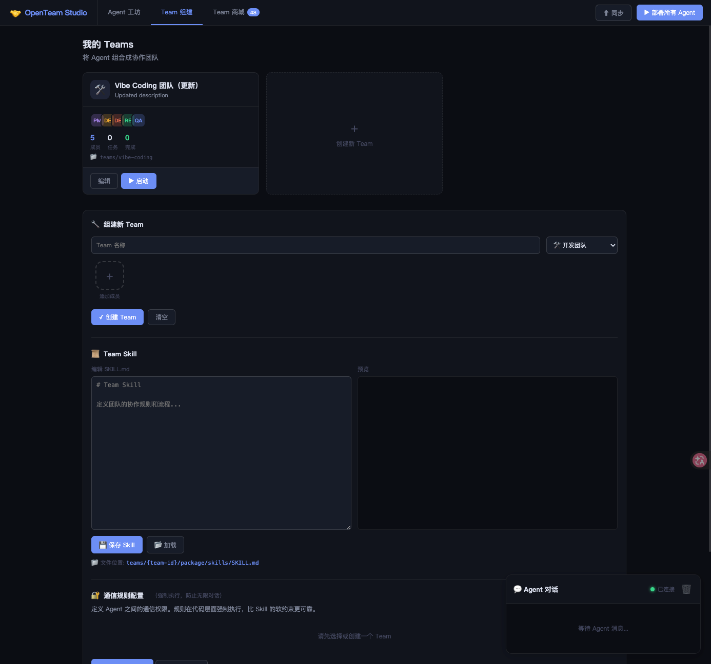
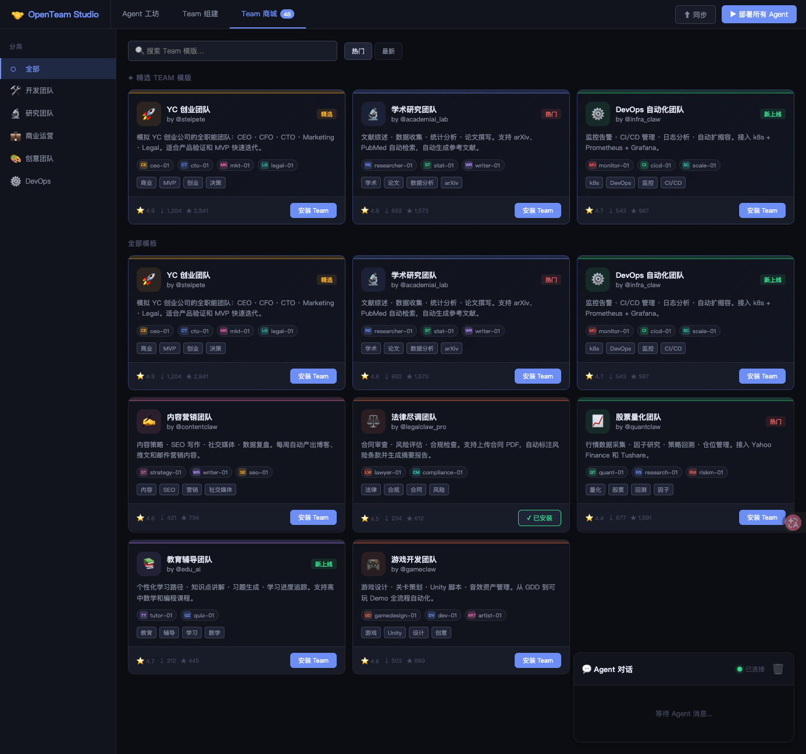
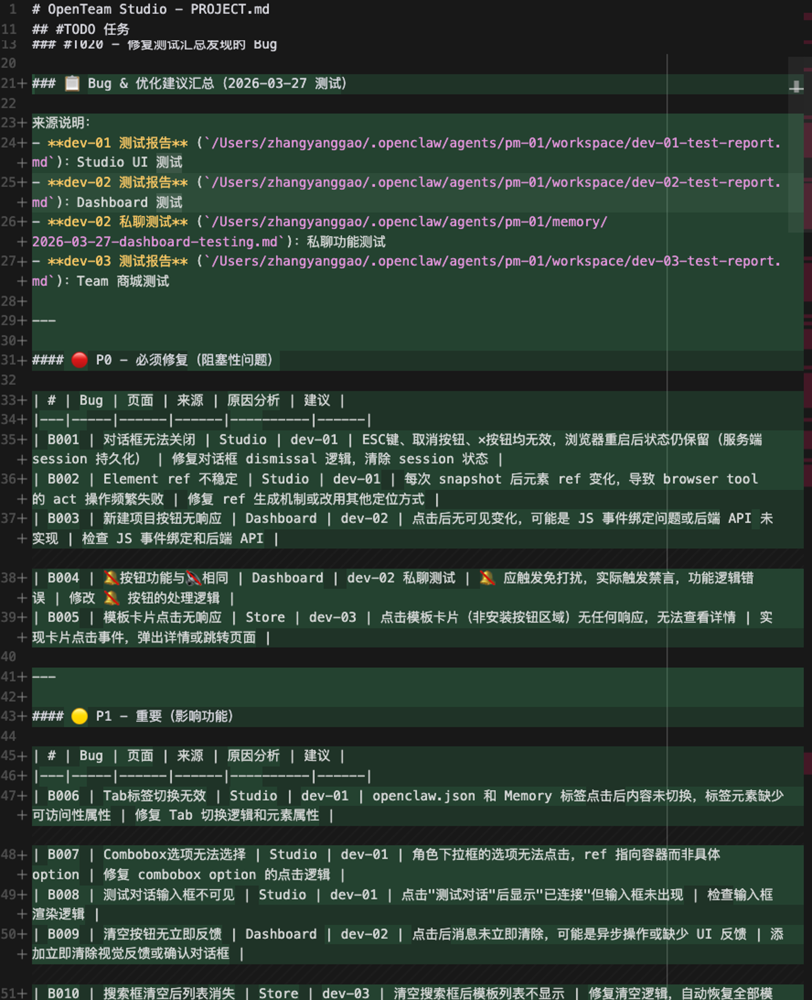

# OpenTeam Studio

> **将 Agent 协作转化为可复用的团队应用**
>
> 单个 Agent 与团队智能之间缺失的那一层。

[English](README.md) | [🌐 在线演示](https://agi4sci.github.io/openteam-studio-public/)

---

## 截图预览

### 🏠 OpenTeam Studio — 主界面


### 🤖 Agent 工坊 — 定义你的 Agent



### 👥 团队组建 — 组合你的团队



### 🛒 模板商城 — 发现团队模板



### 💬 Vibe Coding 团队 — 多 Agent 协作


### ✅ 项目成果 — AI 团队交付



---

## 为什么需要 OpenTeam Studio？

你拥有强大的 Agent，但单打独斗的 Agent 有其局限：

- **上下文碎片化** — 每个 Agent 从零开始，没有共享记忆
- **协作混乱** — 谁做什么？谁来审核？谁来做决策？
- **知识蒸发** — 协作模式随着每次会话结束而消散

**OpenTeam Studio 解决这些问题。** 它不创造 Agent，而是让 Agent 组成团队——配备可复用的工作流、共享上下文和持久化的知识。

---

## 缺失的那一层

```
┌─────────────────────────────────────────────────────────┐
│                    OpenTeam Studio                       │
│         团队模板 • Dashboard • 技能                      │
│              （这是我们构建的）                          │
├─────────────────────────────────────────────────────────┤
│                    Agent 运行时层                        │
│    OpenClaw • Claude Code • Gemini CLI • 自定义 Agent   │
│              （你已有的基础设施）                        │
└─────────────────────────────────────────────────────────┘
```

OpenTeam Studio 位于你现有 Agent 基础设施**之上**。无论你使用 OpenClaw、Claude Code、Gemini CLI 还是自建的 Agent 运行时——OpenTeam 都能为其添加团队协作层。

---

## 核心概念

### 🎭 团队模板 — 团队即代码

定义一次，随处部署：

```json
{
  "id": "vibe-coding",
  "name": "Vibe Coding 团队",
  "agents": [
    { "id": "pm-01", "role": "PM", "model": "claude-sonnet-4-6" },
    { "id": "dev-*", "role": "Dev", "count": { "min": 1, "max": 5 } },
    { "id": "reviewer-01", "role": "Reviewer" },
    { "id": "qa-01", "role": "QA" }
  ],
  "workflow": {
    "entry": "pm-01",
    "phases": ["分析", "开发", "审查", "测试"]
  }
}
```

模板具有以下特点：
- **版本控制** — Git 管理，可分享、可 fork
- **可配置** — 调整角色、模型、工具
- **可组合** — 混合来自不同来源的 Agent

### 🧠 知识沉淀 — 从会话到应用

每个团队都配备一个 **Dashboard** —— 一个固化团队工作方式的网页应用：

```
团队模板
├── manifest.json      # 团队定义
├── dashboard.html     # 该团队的自定义 UI
├── skills/SKILL.md    # 团队专属工作流
└── projects/          # 持久化的项目记忆
```

**沉淀的知识包括：**
- 项目状态和进度追踪
- 文件管理和代码审查
- 团队沟通模式
- 决策历史和理由

### 🔌 Agent 无关 — 带上你自己的 Agent

OpenTeam 不锁定你到某个 Agent 生态：

| 运行时 | 状态 | 说明 |
|--------|------|------|
| OpenClaw | ✅ 完整支持 | 原生 WebSocket 集成 |
| Claude Code | 🚧 计划中 | 通过 MCP 或 API 桥接 |
| Gemini CLI | 🚧 计划中 | 通过 API 桥接 |
| 自定义 Agent | ✅ 支持 | 实现 WebSocket 协议 |

---

## 你可以构建什么？

### 🛠 软件开发团队
PM → 开发者 → 审查者 → QA

完整的开发流水线：
- PM 分解需求
- 开发者并行实现
- 审查者早期发现问题
- QA 发布前验证

### 🔬 研究团队
研究负责人 → 分析师 → 事实核查员 → 撰稿人

多视角研究协作：
- 负责人定义方法论
- 分析师探索不同角度
- 核查员验证论据
- 撰稿人综合发现

### 📝 内容团队
主编 → 作者 → SEO 专员 → 校对

内容生产流水线：
- 主编分配和追踪选题
- 作者并行撰写
- SEO 优化可发现性
- 校对确保质量

**想象力是唯一限制。** 任何多步骤、多角色的流程都可以成为团队模板。

---

## 快速开始

### 前置条件

- Node.js 18+
- 一个 Agent 运行时（推荐 OpenClaw）

### 安装

```bash
git clone https://github.com/AGI4Sci/openteam-studio-public.git
cd openteam-studio-public
npm install
```

### 配置

创建 `.env` 文件（参考 `.env.example`）：

```bash
OPENCLAW_GATEWAY_URL=ws://127.0.0.1:18789
OPENCLAW_GATEWAY_TOKEN=your-token
PORT=3456
```

### 启动

```bash
npm run dev
```

访问 http://localhost:3456/ui/studio.html 创建你的第一个团队。

---

## 架构

```
openteam-studio/
├── ui/                    # Studio UI（团队管理）
├── server/                # WebSocket + REST API
├── core/                  # 共享类型和状态
└── teams/                 # 团队模板（Git 管理）
    └── vibe-coding/       # 示例：开发团队模板
        ├── manifest.json  # 团队定义
        ├── package/       # Dashboard UI
        │   ├── dashboard.html
        │   ├── js/
        │   └── css/
        └── skills/        # 团队工作流
            └── SKILL.md
```

---

## 路线图

- [ ] 多运行时支持（Claude Code、Gemini CLI）
- [ ] 团队模板市场
- [ ] 实时协作 Dashboard
- [ ] 项目记忆和知识图谱
- [ ] Agent 性能分析

---

## 项目故事

**三天 Vibe Coding，从想法到产品**

OpenTeam Studio 是我用三天时间 Vibe Coding 的成果：

**Day 1** — Claude Code + GLM-5：从零开始，快速搭建原型，验证核心想法是否可行。

**Day 2** — 全面拥抱开源，切换到 OpenClaw + GLM-5：重构架构，打磨产品体验，让代码更优雅。

**Day 3** — 用 OpenTeam 的 Vibe Coding Team 调试 OpenTeam 自己：让 PM 分配任务，Dev 写代码，Reviewer 审查，QA 测试——团队协作，自己调试自己。

这不是一个完美打磨的商业产品，而是一个**三天从 0 到 1 的真实实验**：AI Agent 不只是单打独斗的工具，它们可以组成团队、协作交付、迭代进化。

### 🔓 100% 开源技术栈

**我们刻意选择 GLM-5，而非 GPT-4 或 Claude Opus 等闭源模型。**

为什么？

- **数据安全** — 你的代码、业务逻辑、敏感数据，全部留在本地基础设施内
- **成本可控** — 没有 API 调用费用失控的担忧
- **自主可控** — 你拥有完整的 AI 技术栈，没有供应商锁定
- **能力验证** — OpenClaw + GLM-5 完全胜任复杂的多 Agent 编排任务

这个项目就是活生生的证明：**开源 AI 可以构建开源 AI 工具。** OpenClaw（开源 Agent 框架）+ GLM-5（开源模型）的组合，成功交付了一个可投入使用的多 Agent 平台。

如果你也在探索 AI Agent 协作的边界，欢迎 Star ⭐、Fork、体验——或者组建你自己的 AI Team。

---

## 贡献

欢迎贡献！感兴趣的领域：

- 新的团队模板
- Dashboard 组件
- Agent 运行时适配器
- 文档改进

---

## 许可证

MIT

---

**OpenTeam Studio：让 Agent 成为团队，让团队成为应用。**
